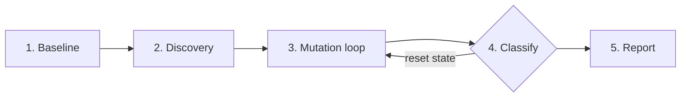

<p align="center">
  <h1 align="center">⚡ spark-mutator</h1>
  <p align="center">
    <strong>Zero-touch mutation testing for Apache Spark</strong>
  </p>
  <p align="center">
    
    
    
    
  </p>
</p>

`spark-mutator` rewrites your **Catalyst logical plans during test execution** and
reports whether your tests actually notice. It's the difference between a test
suite that *passes* and one that *protects*.

> **Semantic mutation testing, not bytecode.** We mutate the query plan itself —
> the join type, the filter predicate. If your tests don't catch a mutated join,
> they wouldn't catch the real bug it's guarding against either.

---

## Why it matters

A green test suite can still be blind to the bugs that actually ship:

| Mutant injected | What it exposes |
| --- | --- |
| `INNER → LEFT / CROSS / ANTI` | your data lacks unmatched-key coverage |
| `A ∧ B → A`, `B`, `false`, `¬P` | incomplete branch coverage, redundant predicates |

`spark-mutator` injects these and classifies each one:

| Outcome | Meaning |
| --- | --- |
| 🟢 `KILLED` | a test caught the mutation |
| 🔴 `SURVIVED` | no test caught it — a blind spot |
| ⏱️ `TIMED_OUT` | the mutated query hung *(counted as killed)* |
| ⚠️ `ERRORED` | the mutation crashed the driver |

The headline number is the **mutation score** — the share of mutations your
tests detect:

<p align="center">
  <code>mutation score = (killed + timed_out) / (killed + timed_out + survived)</code>
</p>

---

## Quick start

```bash
pip install pytest-spark-mutator
cd your-pipeline
pytest --spark-mutate
```

That's it. **No changes to your pipeline or tests.** The plugin runs your suite
once unmutated, discovers every mutation site, then re-runs only the affected
tests against each mutant — fail-fast.

Optional config in `pyproject.toml`:

```toml
[tool.spark-mutator]
target_modules   = ["my_pipeline.transforms"]   # scope discovery
excluded_mutators = ["CrossJoinMutator"]        # skip a rule
timeout_multiplier = 2.0                        # per-mutant deadline
min_mutation_score = 80.0                       # CI gate
```

---

## How it works



1. **Baseline** — run the suite unmutated; abort if it isn't green.
2. **Discovery** — walk the analyzed `LogicalPlan`; catalogue each mutation site
   with a stable, reproducible id.
3. **Mutation loop** — activate one mutant, run its mapped tests fail-fast.
4. **Classify** — `KILLED` / `SURVIVED` / `TIMED_OUT` / `ERRORED`, then reset all
   Spark state so results can't leak between mutants.
5. **Report** — terminal summary, `mutation-report.json`, SARIF, HTML.

---

## The point, in one example

A weak test that only checks `count()`:

```python
assert build_report(orders_df, customers_df).count() == 2
```

…misses a mutated join that returns the *same count but different rows*. A
stronger test that asserts the exact rows kills it:

```python
expected = {(1, "C1", 150, "COMPLETED"), (2, "C2", 150, "COMPLETED")}
actual = {(r.order_id, r.customer_id, r.amount, r.status)
          for r in build_report(orders_df, customers_df).collect()}
assert actual == expected
```

The first lets the mutant `SURVIVE`; the second `KILL`s it. **That difference is
the whole point.** See `examples/pyspark-pipeline/` for a runnable proof.

---

## Features

- ✅ **Zero-touch** — no pipeline or test code changes.
- ✅ **Semantic mutations** — plan-level rewrites, not bytecode tricks.
- ✅ **Deterministic ids** — stable, reproducible mutant ids across runs.
- ✅ **Test impact mapping** — only the tests touching a mutant re-run.
- ✅ **Fail-fast** — stop at the first failing test per mutant.
- ✅ **Timeout watchdog** — two-channel cancellation for hung queries.
- ✅ **Driver resilience** — circuit breaker that force-kills a wedged driver.
- ✅ **Rich reports** — JSON, SARIF, and HTML artifacts for CI gating.

## Implemented today

- **PySpark**, end-to-end, via the `pytest` plugin.
- **Spark 3.5.x / Scala 2.13** shim.
- **Join** mutators — `INNER → LEFT`, `CROSS`, `ANTI`.
- **Filter** mutators — `A ∧ B → A`, `B`, `false`, `¬P`.

The Java/Scala Maven-plugin path and further mutators (aggregate, window,
null/type) are on the roadmap — see [`docs/core_idea.md`](docs/core_idea.md).

---

## Repository layout

```
mutator-core/          Java   — registry, hashing, catalog, reports (zero Spark imports)
catalyst-interceptor/  Scala  — Catalyst rule + versioned Spark shims
python/                Python — pytest plugin, Py4J bridge, watchdog, circuit breaker
examples/              runnable verification pipelines
docs/                  core idea, architecture, contracts
```

---

## Documentation

- [Core idea](docs/core_idea.md) — the vision and requirements.
- [Architecture](docs/ARCHITECTURE.md) — how it's built.
- [Contracts](docs/CONTRACTS.md) — the frozen API surface (contributor reference).
- [Adding a Spark version](docs/VERSION_ADDITION_SOP.md) — the runbook for a new shim.

---

## Status

Active development. PySpark on Spark 3.5.x is usable end-to-end; more Spark
versions and mutator categories are in progress.
