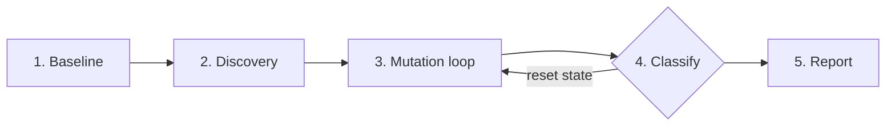

<p align="center">
  <h1 align="center">⚡ spark-mutation-testing</h1>
  <p align="center">
    <strong>Zero-touch mutation testing for Apache Spark</strong>
  </p>
  <p align="center">
    
    
    
    
  </p>
</p>

`spark-mutation-testing` rewrites your **Catalyst logical plans during test execution** and
reports whether your tests actually notice. It's the difference between a test
suite that *passes* and one that *protects*.

> **Semantic mutation testing, not bytecode.** We mutate the query plan itself —
> the join type, the filter predicate. If your tests don't catch a mutated join,
> they wouldn't catch the real bug it's guarding against either.

---

## Why it matters

A green test suite can still be blind to the bugs that actually ship:

| Mutant injected | What it exposes |
| --- | --- |
| `INNER → LEFT / CROSS / ANTI` | your data lacks unmatched-key coverage |
| `A ∧ B → A`, `B`, `false`, `¬P` | incomplete branch coverage, redundant predicates |

`spark-mutation-testing` injects these and classifies each one:

| Outcome | Meaning |
| --- | --- |
| 🟢 `KILLED` | a test caught the mutation |
| 🔴 `SURVIVED` | no test caught it — a blind spot |
| ⏱️ `TIMED_OUT` | the mutated query hung *(counted as killed)* |
| ⚠️ `ERRORED` | the mutation crashed the driver |

The headline number is the **mutation score** — the share of mutations your
tests detect:

<p align="center">
  <code>mutation score = (killed + timed_out) / (killed + timed_out + survived)</code>
</p>

---

## Quick start

```bash
pip install pytest-spark-mutation-testing
cd your-pipeline
pytest --spark-mutate
```

That's it. **No changes to your pipeline or tests.** The plugin runs your suite
once unmutated, discovers every mutation site, then re-runs only the affected
tests against each mutant — fail-fast.

Optional config in `pyproject.toml`:

```toml
[tool.spark-mutator]
target_modules   = ["my_pipeline.transforms"]   # scope discovery
excluded_mutators = ["CrossJoinMutator"]        # skip a rule
timeout_multiplier = 2.0                        # per-mutant deadline
min_mutation_score = 80.0                       # CI gate
```

---

## Quick start — Java / Scala (Maven, JUnit 5)

Two test-scoped dependencies and one annotation. Existing tests stay untouched:

```xml
<dependency>
  <groupId>io.github.wpunit13</groupId>
  <artifactId>mutator-junit5</artifactId>
  <version>1.0.0-SNAPSHOT</version>
  <scope>test</scope>
</dependency>
<dependency>
  <groupId>io.github.wpunit13</groupId>
  <artifactId>interceptor-bundle-spark-3.5_2.13</artifactId> <!-- match your Spark/Scala line -->
  <version>1.0.0-SNAPSHOT</version>
  <scope>test</scope>
</dependency>
```

```java
import io.github.wpunit13.mutator.junit5.EnableSparkMutationTesting;

@EnableSparkMutationTesting
class MyPipelineTest { /* existing tests unchanged */ }
```

**Where to put the annotation** — not on every class:

- **Shared base class (recommended).** The annotation is `@Inherited` — put it
  on your `AbstractSparkTest` once and every subclass is covered.
- **No base class?** Annotate each Spark-touching test class — one line each,
  mechanical. Non-Spark classes need nothing. (WP-26, planned, removes the
  requirement entirely for the Maven plugin path.)
- **Maven plugin path (`mutate`, CI).** At least one annotated class must
  execute in each run: the extension is the fork-side bridge that hands
  `catalog.json` and the applied markers back to the Mojo. **Zero annotated
  classes ⇒ a silent empty report** (zero mutants, score 0.0%, build green).
  Several annotated classes are fine — the bridge writes are safe to repeat.
- **In-process standalone (`mvn test`).** The annotated class *drives the
  loop* (its `afterAll` re-runs the suite per mutant and writes the report).
  Run **one annotated class per run** — select it with Surefire
  `<includes>`/a profile (the example's `-Pweak`/`-Phardened` do exactly
  this). Multiple annotated classes in one run each trigger their own loop;
  that configuration is untested.
- **Auto-detection.** Not shipped — `mutator-junit5` registers no
  `ServiceLoader` entry. A hand-rolled
  `META-INF/services/org.junit.jupiter.api.extension.Extension` +
  `junit.jupiter.extensions.autodetection.enabled=true` works for the Maven
  plugin path (fork mode tolerates every class carrying the extension) but
  must not be combined with standalone mode, where every registered class
  would trigger its own mutation loop.

Then either:

```bash
mvn test                                        # in-process loop (no plugin needed)
mvn test-compile spark-mutation-testing:mutate  # fork-per-mutant loop (CI-grade)
```

> The plugin goal injects the mandatory Java 17+ JVM opens into Surefire for
> you. The in-process `mvn test` path runs in *your* Surefire fork, so there
> you add them yourself (once, in your Surefire `argLine`) — see
> [`docs/developer-guide.md`](docs/developer-guide.md) §1.2.

The Maven plugin auto-detects your Spark/Scala versions, resolves the matching
interceptor, and injects the Spark extension **plus the mandatory Java 17+ JVM
opens** into Surefire — no manual Surefire wiring. Reports land in
`target/spark-mutator-reports/` (`json` + `sarif` + `html`).

- Full guide: [`docs/developer-guide.md`](docs/developer-guide.md)
- Runnable proof: [`examples/spark-java-pipeline/`](examples/spark-java-pipeline/)
  (weak suite ⇒ mutants survive; hardened suite ⇒ mutants killed)
- Supported today: Spark 3.5.x (Scala 2.12/2.13) and 4.2.x (Scala 2.13), JUnit 5
  (Java or JUnit 5-in-Scala). ScalaTest bridge is planned (WP-18).

---

## How it works



1. **Baseline** — run the suite unmutated; abort if it isn't green.
2. **Discovery** — walk the analyzed `LogicalPlan`; catalogue each mutation site
   with a stable, reproducible id.
3. **Mutation loop** — activate one mutant, run its mapped tests fail-fast.
4. **Classify** — `KILLED` / `SURVIVED` / `TIMED_OUT` / `ERRORED`, then reset all
   Spark state so results can't leak between mutants.
5. **Report** — terminal summary, `mutation-report.json`, SARIF, HTML.

---

## The point, in one example

A weak test that only checks `count()`:

```python
assert build_report(orders_df, customers_df).count() == 2
```

…misses a mutated join that returns the *same count but different rows*. A
stronger test that asserts the exact rows kills it:

```python
expected = {(1, "C1", 150, "COMPLETED"), (2, "C2", 150, "COMPLETED")}
actual = {(r.order_id, r.customer_id, r.amount, r.status)
          for r in build_report(orders_df, customers_df).collect()}
assert actual == expected
```

The first lets the mutant `SURVIVE`; the second `KILL`s it. **That difference is
the whole point.** See `examples/pyspark-pipeline/` for a runnable proof.

---

## Features

- ✅ **Zero-touch** — no pipeline or test code changes.
- ✅ **Semantic mutations** — plan-level rewrites, not bytecode tricks.
- ✅ **Deterministic ids** — stable, reproducible mutant ids across runs.
- ✅ **Test impact mapping** — only the tests touching a mutant re-run.
- ✅ **Fail-fast** — stop at the first failing test per mutant.
- ✅ **Timeout watchdog** — two-channel cancellation for hung queries.
- ✅ **Driver resilience** — circuit breaker that force-kills a wedged driver.
- ✅ **Rich reports** — JSON, SARIF, and HTML artifacts for CI gating.

## Implemented today

- **PySpark**, end-to-end, via the `pytest` plugin (baseline, fail-fast loop, timeout watchdog, circuit breaker).
- **Java & Scala pipelines**, end-to-end, via the Maven plugin (`spark-mutation-testing:mutate`) and the JUnit 5 bridge (`mutator-junit5`).
- **Spark 3.5.x / Scala 2.12 + 2.13** shims and **Spark 4.2.x / Scala 2.13** shim, with pinned cross-version goldens (a coordinate computed under 3.5 addresses the same logical mutation under 4.2).
- **Mutator families** — Join (`INNER → LEFT`/`CROSS`/`ANTI`), Filter (`A ∧ B → A`/`B`/`false`/`¬P`), Aggregate, Window, Null-Coalesce, Project.
- **CI version matrix** — one leg per supported Spark/Scala combination (`3.5_2.12`, `3.5_2.13`, `4.2_2.13`), each verifying its shim's goldens and its bundled wheel jar.

Planned next: filling the N-2 window (Spark 4.1/4.0 combinations via the
[version-addition SOP](docs/VERSION_ADDITION_SOP.md)), first-class ScalaTest
support (WP-18, deferred), and further governance gates.

---

## Building from source

### Prerequisites

- **Java 17** (Spark 3.5 requires Java 17 for Scala 2.13 compilation)
- **Apache Maven 3.8+**
- **Python 3.9+** with `pytest` and `pyspark`

### 1. Build and package the Java/Scala engine

```bash
mvn clean package -DskipTests
```
This compiles `spark-mutation-testing-core`, the Catalyst interceptor shims, and creates the shaded uber-jar at `catalyst-interceptor/interceptor-bundle/target/interceptor-spark-3.5_2.13.jar`.

### 2. Bundle the jar into Python package data

```bash
python python/build_hooks/bundle_jars.py
```
This syncs the shaded jar into `python/pytest_spark_mutator/jars/` so the pytest plugin can resolve and mount it via `PYSPARK_SUBMIT_ARGS`.

### 3. Install the Python plugin in development mode

```bash
pip install -e python/ --no-deps
```

### 4. Run tests and verification

```bash
# Run unit tests
cd python && python -m pytest -v

# Run end-to-end survival/kill verification on example pipeline
python scripts/verify_e2e.py
```

> [!TIP]
> On macOS with an active VPN or tunnel interface (e.g., Tailscale), set `SPARK_LOCAL_IP=127.0.0.1` so Spark binds local Netty RPC traffic directly to loopback.

---

## Repository layout

```
mutator-core/          Java   — registry, hashing, catalog, reports (zero Spark imports)
catalyst-interceptor/  Scala  — Catalyst rule + versioned Spark shims
mutator-junit5/        Java   — JUnit 5 extension (in-process + bridge modes)
maven-plugin/          Java   — Maven plugin: fork-per-mutant orchestration for Java & Scala
python/                Python — pytest plugin, Py4J bridge, watchdog, circuit breaker
examples/              runnable verification pipelines (pyspark, spark-java, spark-scala)
docs/                  core idea, architecture, contracts, guides, work packages
```

---

## Documentation

- [Core idea](docs/core_idea.md) — the vision and requirements.
- [Catalyst internals](docs/CATALYST.md) — how Catalyst behaves and exactly how this library bends it (teaching document / whitepaper seed).
- [Architecture](docs/ARCHITECTURE.md) — how it's built.
- [Developer guide](docs/developer-guide.md) — orchestration modes, fork-boundary protocol, config, and the quality gate.
- [Releasing](docs/RELEASING.md) — the release runbook: version model, the ritual, guard rails.
- [Scala pipelines](docs/SCALA_PIPELINES.md) — Scala-based Spark pipeline support (JUnit 5 today; ScalaTest status).
- [Gradle](docs/GRADLE.md) — the thin path: in-process mutation testing under Gradle's `test` task (no plugin).
- [Contracts](docs/CONTRACTS.md) — the frozen API surface (contributor reference).
- [Test & verification strategy](docs/TEST_STRATEGY.md) — what proves what, the regression net, and how to verify a new Spark version.
- [Adding a Spark version](docs/VERSION_ADDITION_SOP.md) — the runbook for a new shim.

---

## Status

Active development. PySpark, Java, and Scala (JUnit 5-in-Scala) pipelines on
Spark 3.5.x and 4.2.x are usable end-to-end; N-2 window fill-in (4.1/4.0), the
ScalaTest bridge, and further governance gates are planned.
