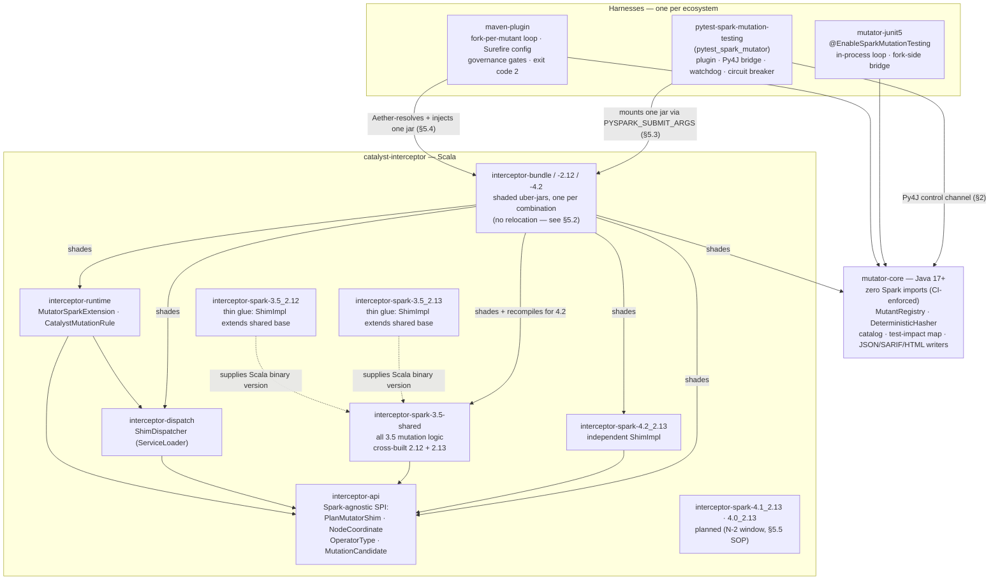
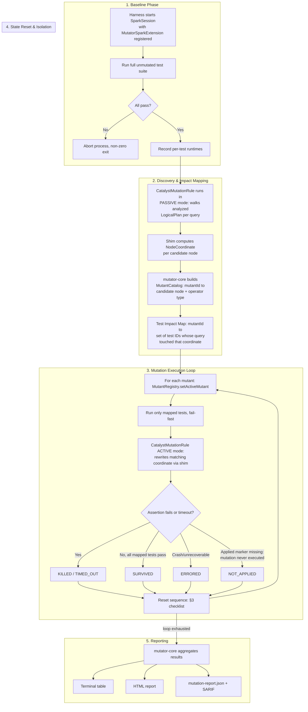
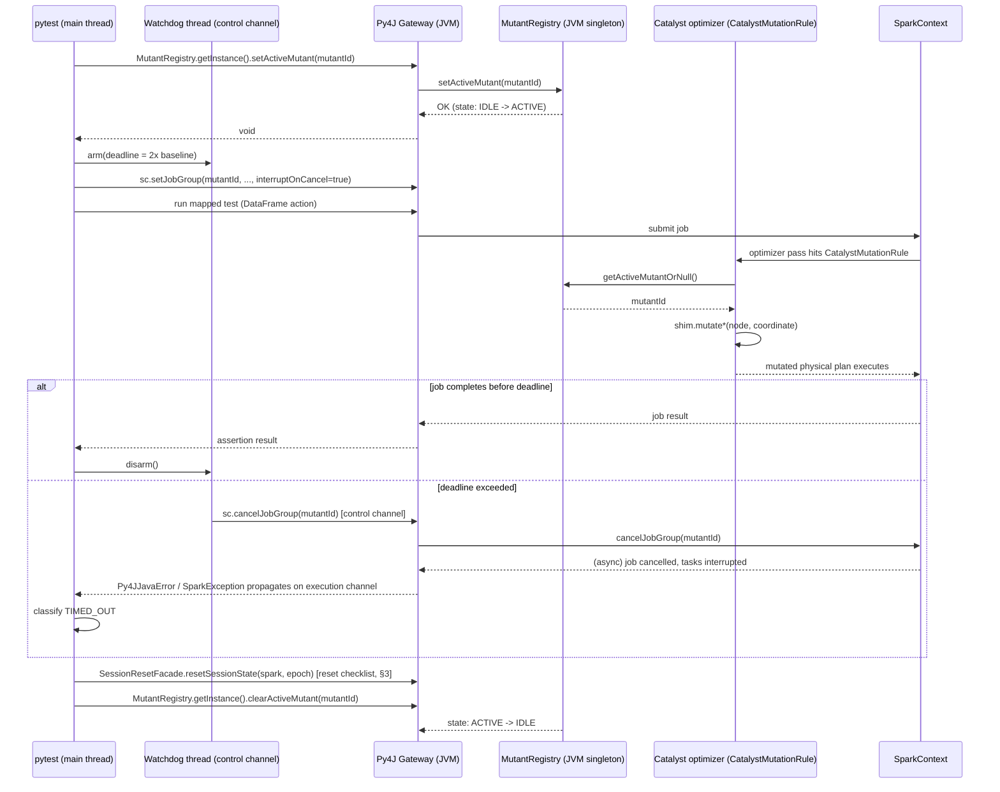

# `spark-mutator` — System Architecture

**Status:** Normative architecture specification. Every numbered rule in this
document is a binding constraint for implementation agents. Where a decision
is left open, it is explicitly marked `[OPEN]`; everything else is fixed.

---

## 1. System Topology & Module Boundaries

### 1.1 Module Graph




> **Currently implemented shims:** `interceptor-spark-3.5_2.12`,
> `interceptor-spark-3.5_2.13`, and `interceptor-spark-4.2_2.13` (WP-20).
> A shim is keyed to a **Spark/Scala combination** — one Spark minor version ×
> Scala binary version pair, keyed `<sparkMinor>_<scalaBinary>` (the frozen
> `VERSION_ADDITION_SOP.md` calls it a "cell"). Under the lifecycle policy
> (spec §7.2, revised WP-20) the supported set is
> the **latest LTS line plus the N-2 window**: Spark 3.5 is the LTS line
> (EOL 2027-11) and 4.2 is the current GA minor; Spark 3.4 (EOL since October
> 2024) is dropped and will never be added. The 4.1_2.13 and 4.0_2.13
> combinations sit inside the N-2 window and remain *planned* backlog — adding
> them follows [`VERSION_ADDITION_SOP.md`](VERSION_ADDITION_SOP.md) exactly as
> WP-20 added 4.2_2.13.
>
> **Planned topology change (WP-26):** the fork-side harness glue (mutant
> activation, catalog/marker handoff) moves from `mutator-junit5` into
> `MutatorSparkExtension` (config-activated, shutdown-hook handoff), making
> the Maven plugin path pom-only.

**Dependency direction is strictly one-way and acyclic:**
`mutator-core` → nothing Spark-specific. `interceptor-api` → minimal Catalyst
top-level types only (§5.1). `interceptor-spark-*` → concrete Catalyst
internals for exactly one binary combination (the 3.5 pair share
`interceptor-spark-3.5-shared`; only `supportedVersion` differs per binary).
`maven-plugin`, `mutator-junit5`, and `pytest-spark-mutation-testing` → `mutator-core`
(+ the dispatcher via the runtime), never a concrete shim directly. The
`interceptor-bundle-*` leaf modules exist to break a reactor cycle
(`interceptor-runtime` test-depends on a shim; a shim cannot therefore depend
on runtime) and assemble the single jar each harness mounts.

**Invariant (from spec §7.1):** `mutator-core` and the reporting/report-model
code MUST NOT import any class under `org.apache.spark.sql.catalyst.*`. This
is enforced by a build-time check (§5, CI gate) that fails the build if such
an import appears outside `catalyst-interceptor/`.

### 1.2 Lifecycle Trace Across Modules



**Key architectural point:** the *Discovery* phase and the *Mutation Execution
Loop* phase both execute through the same `CatalystMutationRule`, distinguished
only by `MutantRegistry` state (`IDLE` = passive observation/cataloging,
`ACTIVE(id)` = rewrite; the rule itself is registered twice — post-hoc
resolution for discovery/matching, optimizer entry for the guaranteed-executed
rewrite). This guarantees the coordinate space observed during
discovery is identical to the coordinate space addressed during mutation —
there is no separate "planning pass" that could drift from the "mutation
pass."

---

## 2. Py4J IPC Protocol & Lifecycle

### 2.1 Why Direct Py4J Calls, Not Env Vars or Sockets

Restarting the JVM per mutant (env var re-injection) reintroduces the startup
cost the spec explicitly forbids (§2, Single-Session Reuse). A bespoke TCP
socket duplicates a channel Py4J already provides. The design therefore
routes **all** control-plane calls through the existing Py4J `GatewayServer`
that PySpark already owns (`spark._sc._gateway`), calling directly into
`mutator-core` classes that are already on the driver classpath because
`pytest-spark-mutation-testing` mounted the interceptor JAR into `spark.jars` at
session creation.

### 2.2 Two-Channel Model (mandatory)

Py4J's default `GatewayServer` is **synchronous per call on the invoking
socket connection**, but the underlying `GatewayConnection` handling is
multi-threaded: each distinct `Py4JClientConnection` the Python side opens is
serviced by an independent JVM-side thread. `pyspark`'s default
`launch_gateway()` already maintains a connection pool
(`GatewayClient` with `_gateway_client.deque` of connections), so concurrent
Python threads calling into the JVM do **not** serialize on one lock by
default — this is exploited deliberately:

| Channel | Opened by | Used for | Blocking behavior |
|---|---|---|---|
| **Execution channel** | The pytest test thread itself | `MutantRegistry.setActiveMutant`, running the actual DataFrame action that triggers the mutated plan | Blocks for the full duration of the Spark job |
| **Control channel** | A dedicated watchdog thread started once per pytest session | `sparkContext.cancelJobGroup` (via the gateway handle), `statusTracker.getJobIdsForGroup` health polls, `SessionResetFacade.resetSessionState` | Must return in milliseconds; never waits on a Spark job |

This split is what makes watchdog cancellation possible at all: if a single
channel were used, the watchdog's cancel call would queue behind the hung
job's still-in-flight call on the same socket.

### 2.3 Sequence Diagram — One Mutant Iteration



### 2.4 Wire-Level Contract

- All values crossing the Py4J boundary are restricted to Py4J's cleanly
  bridged types: `String`, `boolean`, `long`, `int`, and `java.util.List<String>`.
  Structured payloads (mutant metadata, catalogs) are serialized to **JSON
  strings** on the JVM side and parsed with `json.loads` on the Python side —
  Py4J's reflective bridging of arbitrary nested POJOs is avoided entirely to
  keep the wire contract stable across shim versions (see `CONTRACTS.md` §4).
- Every JVM entry point reachable from Python is a `public static` method (or
  a method on a JVM-side singleton obtained via a static accessor), because
  Py4J cannot bridge Python-side object construction back into arbitrary JVM
  constructors without an explicit `JavaClass` reference; using static
  singleton accessors avoids depending on Py4J's `java_import`/constructor
  bridging semantics.
- The gateway's `auto_field` and `auto_convert` behaviors are explicitly
  **disabled** for this integration (rely only on explicit method calls) to
  avoid ambiguous overload resolution when `mutantId` strings could otherwise
  be interpreted as other bridgeable types.

### 2.5 Concurrency Isolation

- `MutantRegistry` is a single JVM-wide singleton (§ CONTRACTS.md #1). Because
  both the execution-channel thread and the control-channel thread can call
  into it concurrently, **every** public method is synchronized on an
  internal monitor (or implemented with `AtomicReference` compare-and-swap);
  no method may block on Spark job completion while holding that monitor.
- Only one mutant may be `ACTIVE` at a time system-wide — this is a hard
  invariant enforced by `setActiveMutant` throwing `IllegalStateException` if
  called while another mutant is already active without an intervening
  `clearActiveMutant`. The execution loop is strictly sequential per spec §4,
  so this invariant should never trip in normal operation; tripping it is
  itself treated as an `ERRORED` classification with a diagnostic message,
  since it indicates reset-sequence corruption from a prior mutant.

### 2.6 Failure Handling

| Failure | Detection | Classification | Recovery |
|---|---|---|---|
| Mutant causes JVM exception during job (e.g. `ClassCastException` from a malformed AST rewrite, `ArithmeticException` from a type-downgrade mutator) | `Py4JJavaError` raised on the execution channel, wrapping the JVM exception | `ERRORED` | Reset sequence runs unconditionally in a `finally`; loop proceeds to next mutant |
| Mutant causes a genuine JVM panic (`OutOfMemoryError`, `StackOverflowError`) that leaves the JVM in an unknown state | `Py4JNetworkError` (socket dropped) or explicit `FatalError` marker written by a JVM shutdown hook to a sentinel file before the process dies | `ERRORED`, and the **entire remaining run is escalated** (§6.2 circuit breaker) | Harness force-restarts the driver JVM/`SparkSession`; remaining unexecuted mutants for that run are marked `ERRORED` with reason `driver_crash_pending_requeue` and (if configured) requeued in the fresh session |
| Driver deadlock (mutated join causes an infinite/very-long single-partition computation, or a UDF spins) | Watchdog deadline elapses; `cancelJobGroup` issued on control channel; if job group still listed as active after a grace period via `sparkContext.statusTracker.getJobIdsForGroup` | `TIMED_OUT` (soft) escalating to `ERRORED` (hard, §6.2) if cancellation itself does not clear the job group within the grace period | Escalation ladder, §6.2 |
| Py4J gateway itself becomes unresponsive (control channel calls also stop returning) | Control-channel call exceeds a short fixed timeout (e.g. 5s) | `ERRORED` + hard circuit breaker | Full process-level restart of the JVM child process |

---

## 3. Plan Memoization & Cache Invalidation

Spark's driver holds multiple independent caches that can leak state between
mutants and silently corrupt results (a `SURVIVED` mutant reported only
because a *previous* mutant's cached result satisfied the assertion, or vice
versa). The reset sequence below MUST run, in this exact order, between every
two mutant evaluations, and additionally once after the baseline phase before
the first mutant is activated.

### 3.1 Exhaustive Cache/State Checklist

| # | Cache / State | JVM Call | Why it must be cleared |
|---|---|---|---|
| 1 | Cached `Dataset`/`RDD` storage (`.cache()`/`.persist()`) | `spark.sharedState.cacheManager.clearCache(blocking = true)` (exposed publicly as `spark.catalog.clearCache()`) | A DataFrame cached under the baseline (unmutated) plan would otherwise be served verbatim to a mutated query that logically depends on the same cache key, masking the mutation entirely. |
| 2 | Raw persisted RDDs registered directly with the `SparkContext` (bypassing `Dataset.cache()`) | `sparkContext.getPersistentRDDs.values.foreach(_.unpersist(blocking = true))` | Safety net for tests/pipelines that call `.rdd.persist()` directly, which `cacheManager.clearCache()` does not track. |
| 3 | Session catalog relation/table metadata cache (Guava-backed `tableRelationCache`) | `spark.sessionState.catalog.invalidateAll()` | Stale resolved `CatalogTable`/file-index metadata can cause the analyzer to reuse a pre-mutation resolved plan fragment for data source relations. |
| 4 | Temporary views registered by the test under mutation | Snapshot `spark.catalog.listTables()` (temp-only) immediately before the test and diff against the post-test listing; call `spark.catalog.dropTempView(name)` for every view created during the test | Leaked temp views let a later, unrelated test accidentally read stale mutated output through a name collision. `catalog.reset()` is deliberately **not** used here because it also resets SQL configuration and registered UDFs/functions, which is broader than intended. |
| 5 | Broadcast variables (`BroadcastExchangeExec` reuse, `ContextCleaner`-managed) | No direct "clear all broadcasts" API is safe to call generically; instead, because each mutant re-triggers a fresh `Dataset` construction from the harness (not a mutation of an existing broadcasted `Dataset` instance), stale broadcasts are avoided structurally. As a safety net, force a GC-triggered cleanup checkpoint: `sparkContext.cleaner.foreach(_.doCleanupBroadcast(id, blocking = true))` is **not** invoked per-id (too invasive); instead rely on (1)+(2) plus periodic full unpersist of `sparkContext.getPersistentRDDs` to bound growth. | Broadcast joins are keyed by the physical plan's exchange id, which is freshly generated per plan build in this architecture, so cross-mutant reuse is structurally impossible as long as (1) prevents `Dataset`-level object reuse. |
| 6 | Whole-stage codegen generated-class cache (Janino) | No clearing needed per-mutant under normal operation — Spark's `CodeGenerator` cache is an LRU bounded by `spark.sql.codegen.cache.maxEntries` (default is bounded, not unbounded). This is instead a **long-run growth risk**, handled as a periodic (every *K* mutants, configurable, default `K=500`) call to evict via `spark.conf.set` cache-size cycling or, if unavoidable metaspace growth is observed, a full JVM restart (§6.2). | Mutation changes generated code on essentially every mutant (different AST ⇒ different generated bytecode), so this cache churns constantly; treating it as a periodic/major-restart concern rather than a per-mutant concern balances correctness against the cost of clearing it every iteration. |
| 7 | Adaptive Query Execution subquery/exchange reuse cache (`ReuseExchangeAndSubquery`) | No explicit clear required — this cache is scoped to a single `QueryExecution` instance and is not retained across separate `Dataset` builds, so it cannot leak across mutants under this architecture's "always rebuild the `Dataset` fresh per test" execution model. | Documented here explicitly so implementers do not assume it needs manual invalidation — it does not, given the execution model's constraints. |
| 8 | `MutantRegistry` active-mutant state | `MutantRegistry.getInstance().clearActiveMutant(mutantId)` | Not a Spark cache, but must be the *last* step of the reset sequence so that any lingering asynchronous job triggered by the just-finished test cannot pick up the *next* mutant's id if it races the reset. |

### 3.2 Canonical Reset Sequence (must run in this exact order)

```
1. spark.catalog.clearCache()                                 // (checklist #1)
2. sparkContext.getPersistentRDDs.values.foreach(_.unpersist(blocking = true))  // (#2)
3. spark.sessionState.catalog.invalidateAll()                 // (#3)
4. diff-and-drop temp views created during the just-finished test              // (#4)
5. [every K mutants] codegen cache pressure relief / restart check             // (#6)
6. MutantRegistry.getInstance().clearActiveMutant(mutantId)     // (#8, must be last)
```

This sequence is invoked from `SessionResetFacade.resetSessionState(spark)`
(see `CONTRACTS.md` §4), callable identically from the Maven-plugin-driven
JVM path and the Py4J control channel.

---

## 4. Deterministic Node Addressing

### 4.1 Problem With JVM Identity

Catalyst's `TreeNode` assigns each node an `id: Int` from a JVM-static
`AtomicLong` counter (`TreeNode.nextId` internally) at construction time. This
value is:

1. **Session-relative** — it depends on how many other `TreeNode` instances
   were constructed earlier in the *same* JVM, which varies with the order
   the test suite happens to run in, prior mutants' extra optimizer passes,
   and unrelated Spark internal plan construction (e.g. `DESCRIBE` queries,
   catalog lookups).
2. **Non-portable across processes** — the Maven-plugin path (in-process JVM
   fork per Java/Scala test module) and the PySpark path (long-lived driver
   JVM across an entire pytest session) have completely different id
   sequences for structurally identical plans.
3. **Non-stable across Spark versions** — different Spark minor versions
   construct a different number of internal nodes for the same user-level
   query (e.g. additional `ResolvedHint` or `SubqueryAlias` wrapper nodes
   introduced between versions), shifting the counter differently.

Because `MutantID` (spec §2) must be *reproducible* across repeated runs, and
ideally stable across the supported Spark version matrix for the same
logical mutation, node identity cannot be sourced from `TreeNode.id` or
`System.identityHashCode`.

### 4.2 NodeCoordinate Specification

$$
\text{NodeCoordinate} = \text{trunc}_{64}\Big(\text{SHA-256}\big(\text{CanonicalString}\big)\Big)
$$

$$
\text{CanonicalString} = \texttt{"{depth}|{operatorType}|{childOrdinal}|{exprSig}"}
$$

Where every component is defined precisely as follows:

| Symbol | Type | Definition |
|---|---|---|
| `depth` | non-negative integer | Distance from the root of the **analyzed** `LogicalPlan` (post-analysis, pre-optimization), computed via a fixed **pre-order** DFS starting at `depth = 0` for the root. This traversal point is fixed because it is the earliest point at which all `ExprId`-independent structure is resolved but before the optimizer has a chance to rewrite/collapse nodes differently across Spark versions. |
| `operatorType` | enum tag (fixed string, e.g. `"JOIN"`, `"FILTER"`, `"AGGREGATE"`, `"WINDOW"`, `"PROJECT"`, `"OTHER"`) | Sourced from the **`OperatorType` enum defined in `interceptor-api`**, never from `node.getClass.getName` — the concrete case-class package/name is shim- and version-specific (e.g. shaded builds, internal renames), so only the shim's classification into the fixed enum is used. |
| `childOrdinal` | integer, `-1` for the root, else `0`-based | The index of this node within its **parent's** `children: Seq[LogicalPlan]`, exactly as returned by Catalyst's own `TreeNode.children` ordering (which is itself part of each case class's stable public contract, unlike node ids). |
| `exprSig` | canonical string | The **canonical expression signature** of the node, defined in §4.3. Empty string `""` for operators with no expressions of relevance (e.g. bare `Project` passthrough is still covered since Project always has a projectList). |

Truncation to 64 bits (`trunc64`) takes the first 8 bytes of the SHA-256
digest, rendered as a fixed-width 16-character lowercase hex string. 64 bits
is deemed sufficient collision resistance for the cardinality of plan nodes
in a single test suite (≪ 2^32, well below the birthday-bound danger zone for
a 64-bit space), while keeping ids compact for report readability.

### 4.3 Canonical Expression Signature (`exprSig`)

Catalyst's `Expression.exprId` (via `NamedExpression`/`AttributeReference`) is
**also** an `AtomicLong`-sourced, session-relative identity — the same
non-portability problem as `TreeNode.id` applies to expressions. The
canonical signature therefore replaces every attribute reference with a
**positional placeholder** rather than its `exprId`:

1. Take the node's semantically-relevant expression list (e.g. `condition`
   for `Filter`/`Join`, `projectList` for `Project`, `aggregateExpressions` +
   `groupingExpressions` for `Aggregate`, `windowExpressions` +
   `partitionSpec` + `orderSpec` for `Window`).
2. For each expression tree, render it via Catalyst's own `.sql` (or
   `.toString` fallback where `.sql` is unavailable for a given node type)
   canonicalized form, then apply a regex substitution replacing every
   `AttributeReference`/`NamedExpression` occurrence's `#<exprId>` suffix
   with `#<ordinal>`, where `<ordinal>` is that attribute's zero-based
   position in the node's **output schema** (`output: Seq[Attribute]`) — a
   position that is stable and version-independent for a given logical
   query — rather than its runtime-assigned id.
3. Concatenate the resulting per-expression strings with `;` in the fixed,
   version-independent order defined by the `PlanMutatorShim.classify`
   contract for that operator type (e.g. for `Join`: `joinType;condition`).

This canonicalization is implemented **inside each versioned shim** (it must
touch concrete Catalyst expression types), but the *output format* — the
`exprSig` string grammar — is fixed by this specification and must be
byte-identical across shims for the same logical query, which is what allows
`NodeCoordinate`, and therefore `MutantID`, to remain stable across the
supported Spark version matrix.

### 4.4 Relationship to `MutantID`

The top-level identifier (frozen; see `CONTRACTS.md` and
`mutator-core`'s `DeterministicHasher.computeMutantId`),

$$
\text{MutantID} = \text{trunc}_{64}\Big(\text{SHA-256}\big(\texttt{FilePath} \| \texttt{NodeCoordinate} \| \texttt{OperatorType} \| \texttt{MutationIndex}\big)\Big),
$$

uses `NodeCoordinate` as computed above (the spec's original "PlanNodeId"
term — Spark has no stable plan-node ids, which is the whole point of §4.2).
`OperatorType` is
included redundantly in both formulas deliberately — `NodeCoordinate` already
embeds it, but keeping it explicit in `MutantID` protects against the
(cryptographically remote, but architecturally undesirable to rely on)
possibility of a `NodeCoordinate` collision between two different operator
types being conflated. `MutationIndex` is the 0-based index of this specific
mutation variant among all mutation rules applicable to that operator type
(e.g. `INNER→LEFT` is index 0, `INNER→CROSS` is index 1 for the Join
mutator). `FilePath` is the source file of the **test or pipeline module**
that produced the query being mutated, resolved via the Test Impact Analysis
stack-trace/lineage capture during Discovery (§1.2), not a Spark-internal
path.

`MutantID` uses the same `SHA-256` + `trunc64` construction as
`NodeCoordinate`, over the pipe-delimited concatenation of its four
components in the order given, guaranteeing both ids share one hashing
utility (`mutator-core`'s `DeterministicHasher`, see `CONTRACTS.md`).

---

## 5. Multi-Version Shim Strategy & Packaging

### 5.1 Directory Taxonomy

```
catalyst-interceptor/
├── interceptor-api/                     # Scala, cross-built 2.12 & 2.13
│   ├── src/main/scala/.../OperatorType.scala
│   ├── src/main/scala/.../NodeCoordinate.scala
│   ├── src/main/scala/.../NodeCoordinateFactory.scala
│   ├── src/main/scala/.../PlanMutatorShim.scala
│   ├── src/main/scala/.../MutationCandidate.scala
│   ├── src/main/scala/.../ShimMutationException.scala
│   └── src/main/scala/.../SparkShimVersion.scala
├── interceptor-dispatch/                # Scala, ServiceLoader-based runtime dispatcher
│   └── src/main/scala/.../ShimDispatcher.scala
├── interceptor-runtime/                 # MutatorSparkExtension + CatalystMutationRule
│   │                                    # (registered via spark.sql.extensions)
├── interceptor-spark-3.5-shared/        # ALL 3.5 mutation logic, cross-built 2.12 + 2.13
│   └── src/main/scala/.../Spark35ShimBase.scala
├── interceptor-spark-3.5_2.12/          # thin: ShimImpl extends Spark35ShimBase,
├── interceptor-spark-3.5_2.13/          #   supplies only supportedVersion
├── interceptor-spark-4.2_2.13/          # independent ShimImpl (4.2 Catalyst signatures)
├── interceptor-bundle/                  # shaded uber-jar → interceptor-spark-3.5_2.13.jar
├── interceptor-bundle-2.12/             #   → interceptor-spark-3.5_2.12.jar
├── interceptor-bundle-4.2/              #   → interceptor-spark-4.2_2.13.jar
│                                        #   (recompiles api/dispatch/runtime from
│                                        #    source against Spark 4.2 — see §5.2)
└── (planned: interceptor-spark-4.1_2.13/, interceptor-spark-4.0_2.13/)
    └── (each) src/main/scala/.../ShimImpl.scala + src/main/resources/META-INF/services/...PlanMutatorShim
```

`interceptor-api` is permitted a `provided`-scope compile dependency on the
**oldest supported** `spark-catalyst` artifact strictly to reference
top-level, rarely-changing types (`LogicalPlan`, `Expression`, `Attribute`)
in SPI method signatures. It MUST NOT pattern-match on any concrete case
class (`Join`, `Filter`, `Aggregate`, `Window`, `Project` constructors) —
that is exclusively the job of `interceptor-spark-*` modules. This boundary
is the enforcement point for the isolation guarantee in spec §7.1.

### 5.2 Maven Profile / Reactor Layout

Each `interceptor-spark-<major.minor>_<scala>` module is an **unconditional,
always-built reactor module** — not a Maven profile-gated alternative — because
the packaging step (§5.3) must produce all currently-supported shim JARs
simultaneously so the Python wheel can bundle all of them. Each such module:

- Hard-pins `spark.version` and `scala.version` as module-local properties
  (not inherited flexibly from the root `pom.xml`), e.g.
  `interceptor-spark-3.5_2.13/pom.xml` fixes `<spark.version>3.5.x</spark.version>`
  and `<scala.version>2.13.x</scala.version>` to the specific patch versions
  the CI matrix pins for that combination.
- Depends on `spark-catalyst_<scala>` and `spark-sql_<scala>` at `provided`
  scope (never shaded — these come from the consumer's classpath at runtime).
- Depends on `interceptor-api` at `compile` scope.
- Produces a **plain thin jar** (its own compiled classes plus the
  `META-INF/services` entry) — the shim module itself does **not** shade or
  relocate. The single fat jar is assembled by a separate leaf
  `interceptor-bundle-*` module that shades `mutator-core`, `interceptor-api`,
  `interceptor-dispatch`, `interceptor-runtime`, and the shim together, with
  package relocation **deliberately disabled**: relocating
  `io.github.wpunit13.mutator.api` would rename the `PlanMutatorShim` interface
  that `ServiceLoader` matches and the class named in `spark.sql.extensions`,
  so the shim would no longer be discoverable. Spark itself is never shaded.
- Registers its `PlanMutatorShim` implementation via
  `META-INF/services/io.github.wpunit13.mutator.api.PlanMutatorShim`
  (Java `ServiceLoader` convention) so `interceptor-dispatch` can discover it
  reflectively without a compile-time dependency on any concrete shim module.

The root `pom.xml` aggregator lists every `interceptor-spark-*` module
unconditionally as a `<module>`; there is no `-Dspark.version` activation
switch, because a switch would prevent building "all versions at once,"
which both packaging paths require.

### 5.3 Runtime Resolution — PySpark / Wheel Path

1. **Build time:** the Python build (`python/pyproject.toml`, using a
   `hatch`/`setuptools` build hook or an explicit pre-build Maven invocation)
   copies each `interceptor-spark-<ver>.jar` produced by §5.2 into
   `python/pytest_spark_mutator/jars/`, named exactly
   `interceptor-spark-<major.minor>_<scala>.jar` (this filename *is* the
   lookup key, see step 3).
2. **`pytest_configure` — version detection:** the plugin determines the
   running `pyspark.__version__` (import-time attribute) and the Scala
   binary version by scanning `pyspark/jars/` (the JAR directory bundled
   inside the installed `pyspark` distribution itself) for a filename
   matching `spark-core_(2\.12|2\.13)-.*\.jar`, extracting the Scala suffix.
   This is required because `pyspark.__version__` alone does not disambiguate
   the Scala build.
3. **Lookup:** the plugin consults the static `VERSION_MATRIX: dict[str, str]`
   in `python/pytest_spark_mutator/version_detect.py` mapping
   `"<major.minor>_<scala>"` → jar filename (via `resolve_shim_jar_filename`).
   If `pyspark.__version__` resolves to a minor version not present in the
   matrix (including any version outside the current N-2 window), the plugin
   raises `UnsupportedSparkVersionError`, listing `sorted(VERSION_MATRIX.keys())`
   in the message, and aborts before any `SparkSession` is created.
4. **Mounting:** on match, the plugin resolves the jar's absolute path via
   `importlib.resources.files("pytest_spark_mutator.jars").joinpath(<filename>)`
   and injects it, along with `spark.sql.extensions=io.github.wpunit13.mutator.MutatorSparkExtension`,
   via `PYSPARK_SUBMIT_ARGS` (`--jars <path> --conf spark.sql.extensions=...`)
   **before** any `SparkSession.builder.getOrCreate()` call is reachable —
   the plugin hook fires during `pytest_configure`, which pytest guarantees
   runs before test collection/execution, but the architecture explicitly
   requires that pipeline code under test not construct a `SparkSession`
   at *import* time with a config that overrides `spark.jars`/`spark.sql.extensions`,
   since env-var injection cannot retroactively alter an already-created
   session. This constraint is documented as a user-facing limitation, not
   silently worked around.

### 5.4 Runtime Resolution — Maven/JVM Path

1. The `maven-plugin` inspects the **target project's** resolved test
   classpath (via the Maven `DependencyGraphBuilder`/`ProjectDependenciesResolver`
   API available in the plugin's Mojo execution context) to find the exact
   `org.apache.spark:spark-sql_<scala_ver>:<version>` artifact coordinate
   actually present.
2. It maps `<version>_<scala_ver>` to the corresponding
   `io.github.wpunit13:interceptor-spark-<major.minor>_<scala_ver>`
   artifact coordinate (patch version of the interceptor artifact tracks
   `spark-mutator`'s own release, not the user's Spark patch version — the
   shim only needs to match at the `<major.minor>_<scala>` granularity).
3. It resolves that artifact transitively via the Maven Resolver
   (`Aether`) API at plugin-execution time (not a static `<dependency>` in
   the user's `pom.xml`) and appends its resolved local-repo path to the
   Surefire/Failsafe `additionalClasspathElements`, and merges
   `-Dspark.sql.extensions=io.github.wpunit13.mutator.MutatorSparkExtension`
   plus Spark's mandatory modular-runtime JVM args (the `--add-opens` set)
   into the `argLine` (`SurefireConfigurator`; opt-out
   `-Dspark.mutator.injectAddOpens=false`, no-op on Java 8).
4. If no matching artifact coordinate exists for the detected
   `<major.minor>_<scala_ver>`, the Mojo fails the build with the same
   `UnsupportedSparkVersionError` semantics as the Python path (message
   lists the supported matrix), before Surefire/Failsafe is invoked.

### 5.5 SOP — Adding a New Minor Spark Version

Exact, ordered checklist (expands spec §7.4 to file-level granularity):

1. Create `catalyst-interceptor/interceptor-spark-<major.minor>_<scala>/pom.xml`,
   pinning the exact Spark/Scala patch versions to test against in CI.
2. Implement `PlanMutatorShim` in that module; register it under
   `META-INF/services/...PlanMutatorShim`.
3. Add golden-fixture unit tests asserting `NodeCoordinate`/`MutantID` output
   is byte-identical to the existing supported versions for the shared
   fixture query set (§4.3's cross-version stability guarantee, verified,
   not assumed).
4. Add the module to the root `pom.xml` `<modules>` list.
5. Add the built jar's filename to `python/pytest_spark_mutator/jars/`
   packaging step and its key to `VERSION_MATRIX` in `plugin.py`.
6. Add the new `<major.minor>_<scala>` combination to the CI matrix
   (build + shim unit tests + at least one `examples/` pipeline run per
   language).
7. Update the compatibility table in the top-level `README.md`.
8. If this addition pushes the supported window beyond N-2, perform §5.6
   deprecation for the oldest version in the same PR (never as a follow-up).

### 5.6 SOP — Deprecating an EOL Version

1. Delete `catalyst-interceptor/interceptor-spark-<old>/` entirely.
2. Remove its `<module>` entry from the root `pom.xml`.
3. Remove its entry (and jar file) from `python/pytest_spark_mutator/jars/`
   and `VERSION_MATRIX`.
4. Remove its CI matrix entry.
5. Update the `README.md` compatibility table, moving the version to an
   "unsupported" list.

Per spec §7.2, steps 1–5 must require **zero** changes to `mutator-core`,
`interceptor-api`, `interceptor-dispatch`, the Maven plugin's orchestration
logic, or the pytest plugin's non-version-matrix logic — this is a build-time
enforced property, checked in CI by diff-scoping the deprecation PR to only
the paths listed above.

---

## 6. Driver Resilience & Safeguards

### 6.1 Job Group Tagging

Every mutated test execution is wrapped as:

```
sparkContext.setJobGroup(groupId = mutantId, description = "...", interruptOnCancel = true)
<run mapped test>
sparkContext.clearJobGroup()
```

`interruptOnCancel = true` is mandatory — without it, `cancelJobGroup` marks
tasks for cancellation but does not send `Thread.interrupt()` to executor
task threads, meaning tasks blocked in tight CPU loops (a plausible outcome
of, e.g., a `CROSS` join mutation exploding row counts inside a single
partition) would not actually stop.

### 6.2 Escalation Ladder

> **Implementation status:** stages 1–3 are implemented on the PySpark path
> (`python/pytest_spark_mutator/watchdog.py`, `escalate_cancellation`). The
> Maven fork path enforces the deadline by killing the Surefire fork
> (`SurefireExecutor`). The **JVM in-process path (JUnit 5 extension /
> Gradle) enforces the deadline since WP-25**
> (`SparkMutatorExtension`): the re-run executes on a daemon worker thread
> while the loop thread waits with the deadline, then escalates
> `cancelAllJobs` → interrupt; a worker that survives both channels trips
> the in-process analog of the stage-3 breaker — abandon the loop, flush
> the partial report, fail the run (never `System.exit`, WP-19).

| Stage | Trigger | Action | Resulting classification |
|---|---|---|---|
| 1. Soft cancel | Watchdog deadline (`2 × baseline`) elapses | `sparkContext.cancelJobGroup(mutantId)` via control channel | Provisional `TIMED_OUT` |
| 2. Confirm | Grace period (default `5s`) after stage 1 | Poll `sparkContext.statusTracker.getJobIdsForGroup(mutantId)`; if empty, stage 1 succeeded | Confirmed `TIMED_OUT` (counted as killed, per spec §4.3) |
| 3. Hard ceiling | Job group still listed as active after grace period, up to a hard ceiling (default `4 × baseline`) | Escalate — the job is unresponsive to cooperative cancellation | `ERRORED` |
| 4. Circuit breaker | Stage 3 reached, **or** a JVM panic/unresponsive gateway is detected (§2.6) | Harness force-kills the child JVM process (`Process.destroyForcibly()` for the Maven-plugin-forked JVM; for the PySpark path, `sparkContext.stop()` is attempted first with a short timeout, else the whole Python test-runner process restarts its `SparkContext` from scratch) | Remaining mutants for the run are queued as `ERRORED` (`reason: driver_watchdog_force_kill`) in a **fresh session**, which then resumes processing subsequent mutants — this is an explicit, logged exception to the "single-session reuse" performance goal, only exercised on unrecoverable failure. |

### 6.3 Cartesian Product Explosion Mitigation

> **Implementation status: designed, not implemented.** The `SKIPPED` status
> exists in `MutantStatus` (reserved for the pre-flight gate, excluded from
> the score denominator) but nothing produces it yet — the fork loop's
> `case SKIPPED -> { /* not produced here */ }` is explicit. None of the three
> mechanisms below exist in code (verified by search: no `sizeInBytes`/
> `Statistics`/runaway-listener/AQE-override anywhere). Until shipped, the
> watchdog deadline (§6.2) is the only runaway protection.

1. **Pre-flight cardinality gate:** during Discovery, when the baseline run
   captures each candidate `Join` node's Catalyst `Statistics` (via CBO
   `sizeInBytes`/`rowCount` when statistics are available, else a
   configurable conservative default), the `CrossJoinMutator` and
   `AntiJoinMutator`-style relaxations compute an **estimated worst-case
   output cardinality** (`leftRowCount × rightRowCount` for `CROSS`). If this
   exceeds a configurable ceiling (default `10,000,000` rows), the mutant is
   marked `SKIPPED` (not executed, not counted against mutation score
   denominator) rather than run.
2. **Conservative AQE thresholds during mutation runs:** the harness
   overrides `spark.sql.autoBroadcastJoinThreshold` to a lower value than the
   pipeline's own configuration for the duration of the mutation loop, to
   avoid a mutated join type change (e.g. `INNER → CROSS`) triggering an
   attempted broadcast of a now much larger intermediate result.
3. **Early-exit runaway heuristic:** a `SparkListener` registered for the
   duration of the mutation loop monitors `onTaskEnd`/executor metrics; if
   any single task's shuffle write bytes or output row count exceeds a
   configurable runaway multiple (default `50×`) of the same task's
   baseline-run value, the harness proactively cancels the job group
   immediately rather than waiting for the full watchdog deadline, and
   classifies the result as `TIMED_OUT`.

---

## 7. Risk Register

| # | Risk | Likelihood / Impact | Architectural Mitigation | Residual Risk |
|---|---|---|---|---|
| 1 | Metaspace/CodeCache exhaustion from constantly-churning whole-stage-codegen classes (near-every mutant generates unique bytecode) | Medium / High (long runs can OOM the driver JVM) | Bounded codegen cache (§3.1 #6) + periodic (every *K* mutants) full JVM restart circuit breaker as a scheduled maintenance action, not only a failure response | Very long single-session runs on constrained CI runners may still need a lower *K* than default |
| 2 | `NodeCoordinate`/`MutantID` collisions or drift across shim versions, silently conflating two distinct plan nodes or breaking cross-version reproducibility | Low probability, High impact if it occurs silently | Rigorous, fully specified canonicalization grammar (§4.3) + mandatory golden-fixture cross-version equality tests required by the version-addition SOP (§5.5 step 3) | Novel Catalyst node types introduced by a future Spark version may require a shim classification update before coordinates are computed correctly for that node type |
| 3 | Py4J's synchronous call model causing the watchdog's cancellation call to starve behind a hung execution-channel call | Medium / High (defeats the entire timeout safety net) | Mandatory two-channel design (§2.2) using Py4J's independent connection-per-`GatewayClient` threading model | If PySpark's gateway configuration changes its default connection pooling behavior in a future version, this must be re-verified |
| 4 | Catalyst internal case-class signatures breaking across even *patch* releases within a nominally-supported minor version | Medium / Medium | Shim version pinning at exact patch granularity in CI (§5.2), `interceptor-api` isolation boundary preventing blast radius beyond one shim module | A patch-level break discovered post-release still requires an out-of-band shim patch release before the next scheduled minor-version SOP cycle |
| 5 | Stale Spark caches leaking state between mutants, producing false `SURVIVED`/`KILLED` results | Medium / High (directly corrupts the tool's core output) | Exhaustive, ordered reset checklist (§3) + a periodic no-op "canary mutant" injected into the loop that must always evaluate to `SURVIVED`, used as a self-check that reset state is clean | Novel Spark caching layers introduced by future versions may not be covered until discovered and added to the checklist |
| 6 | Driver crash/hang (OOM, cartesian explosion, infinite loop) halting or corrupting the remainder of a mutation run | Medium / High | Escalation ladder + circuit breaker (§6.2) + pre-flight cardinality gating (§6.3) | A hang inside native code or blocking I/O that ignores `Thread.interrupt()` can still exceed even the hard ceiling before the circuit breaker's forceful kill completes |
| 7 | Scala binary incompatibility: multiple shim JARs (2.12 and 2.13 builds) coexisting on one classpath causing class-loading collisions | Low probability (only one jar is ever mounted per session by design), High impact if it occurs | Runtime selection logic mounts **exactly one** bundle jar per session (§5.3/5.4); bundles deliberately do **not** relocate packages (relocation would rename the `PlanMutatorShim` interface `ServiceLoader` matches and the class named in `spark.sql.extensions`), and distinct shims live in distinct packages so accidental co-presence still cannot collide | A user manually adding a second bundle jar to their own classpath outside the plugin's control is explicitly unsupported and out of scope |
